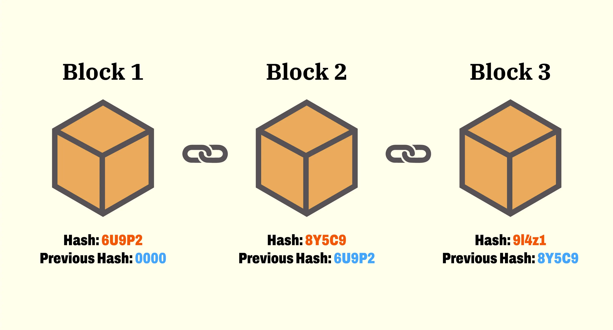
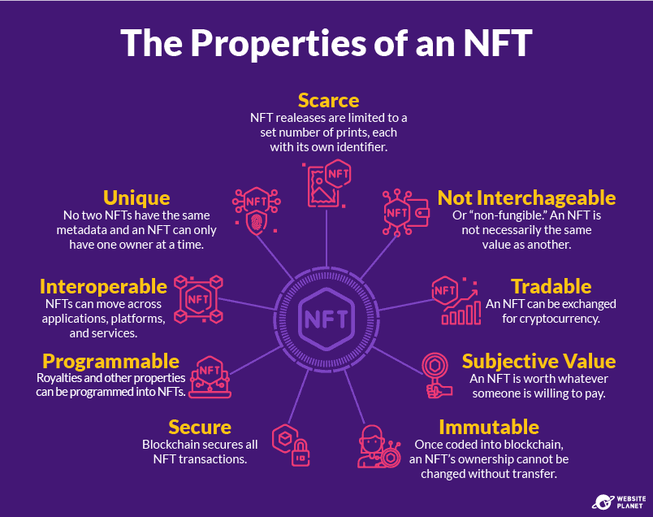

<h1><b>🔗 BlockChain</b></h1>

**Blockchain Technology** is a shared, unchangeable digital database spread across a network of computers, recording transactions in "blocks" linked chronologically with cryptography, creating a secure, transparent, and decentralized system for tracking assets and data without a central authority like a bank. Once data is added to a block and chained, it's nearly impossible to alter, requiring network consensus (agreement) to validate changes, ensuring high security and trust.

 

<table><tr><td></td></tr></table>

 

Its key characteristics are: 

- **Decentralized**: No single entity controls it; copies exist on many computers (nodes). 
- **Immutable**: Data, once recorded, cannot be changed or deleted without altering all subsequent blocks and getting network approval. 
- **Transparent**: All participants can see the shared ledger, allowing for easy tracking and auditing. 
- **Secure**: Uses cryptography (hashes) to link blocks, making tampering evident. 
- **Consensus-driven**: Transactions are verified by the network, not a middleman, through agreement mechanisms. 

<h1><b>🌐 Web3</b></h1>

**Web3** is the vision for the next generation of the internet, shifting from today's centralized platforms (Web2) to a decentralized, user-owned web built on blockchain, focusing on data ownership, privacy, and control for users, rather than big tech companies. It uses technologies like blockchain, cryptocurrency, NFTs, smart contracts, and dApps to create a more open, transparent, and censorship-resistant internet where users have direct say in platforms and digital assets.

**Web3** aims to let communities and open protocols control infrastructure and rules through code, tokens, and smart contracts.

→ From **Web1 and Web2 to Web3**:
- **Web1** (roughly 1990s–early 2000s) focused on static websites where most users just read information; content and hosting were controlled by site owners.

- **Web2** (mid‑2000s onward) introduced dynamic, interactive platforms like social networks, app stores, and cloud services, but concentrated control of data and monetization in large “Big Tech” platforms.​

- **Web3** combines the richer interactivity of Web2 with decentralized infrastructure from blockchain and peer‑to‑peer networks, so that no single company has unilateral control over data, identity, or value flows.

 

<table><tr><td></td></tr></table>

  

<h1><b> But What are NFTs? </b></h1>

**NFTs, or non‑fungible tokens**, are unique digital tokens on a blockchain that are used to represent and prove ownership or authenticity of a specific item such as a piece of art, a game asset, or a collectible. Unlike cryptocurrencies like bitcoin or ether, where every unit is interchangeable with another, each NFT has its own distinct identity and cannot be exchanged on a one‑to‑one basis with another NFT.

An **NFT** is essentially a unique entry on a blockchain **(often Ethereum or similar networks)** that points to some asset and records who owns it. The blockchain stores a token ID under a contract address plus ownership history, so anyone can verify which wallet currently owns that token and how it has moved over time.

**Fungible assets**: One unit is effectively the same as any other unit (for example, one dollar or one bitcoin is interchangeable with another).​

**Non‑fungible assets**: Each unit is different in some way, like a specific painting, a concert ticket with a seat and date, or a specific parcel of land; NFTs encode this uniqueness on‑chain

## → How NFTs work technically?

Most NFTs are created (minted) using standards **like ERC‑721 or ERC‑1155 on Ethereum**, which define how a smart contract manages unique tokens. Each NFT has at least two key 
pieces of on‑chain data: the contract address and a token ID; usually there is also metadata (like a URI pointing to an image, name, and description) that describes the asset.​

 

<table><tr><td></td></tr></table>

 

## → What NFTs can represent?

- Digital art and collectibles (images, animations, music files, videos, memes).
- In‑game items and virtual land in metaverse or gaming platforms.

In many cases, the actual media file is stored off‑chain (e.g., on IPFS or a web server), and the NFT stores a link to it plus ownership data on‑chain.​

→ Practical examples are:

- **A Digital Artwork**: An artist mints a single NFT that represents a specific artwork, lists it on an NFT marketplace, and sells it to a collector; the NFT’s owner field on the blockchain changes to the buyer’s wallet address.​

- **A Game Item**: A sword or skin in a blockchain‑integrated game is an NFT; players can trade it on external marketplaces, and the game reads blockchain ownership to decide who can use the item.

 

<h1><b>⚙️ Smart Contracts</b></h1>

**Smart Contracts** are programs stored on a blockchain that automatically execute and enforce agreements when predefined conditions are met. They remove the need for a central intermediary (like a bank or platform) to run the logic or hold the state of the agreement. Every node in the blockchain network executes this code and records the result, so the outcome is **transparent, tamper‑resistant, and agreed upon by the whole network**.​ 

Once conditions are met (time, input, payment, signatures, etc.), the contract runs on its own and updates balances or state without manual intervention. After deployment, the code and state history are stored on the blockchain; changing logic usually requires deploying a new contract or using an upgrade pattern, and anyone can inspect the contract’s behavior on public chain. All honest nodes running the same contract with the same input must produce the same result, which is then written to the ledger.

 

<table><tr><td></td></tr></table>

  

From the above, we understand the Differnce between Traditional Contracts and Smart Contracts:

| **Traditional Contracts** | **Smart Contracts** |
| ------------- | ------------- |
| 1. Two parties first agree and sign a written contract.  | 1. Two parties agree on terms that are encoded directly into a smart contract (shown as a digital contract with a crypto/Ethereum-like symbol). |
| 2. A trusted third party (like a bank, court, or intermediary institution) is then involved to enforce or process the agreement.  | 2. There is no separate third-party institution step; the blockchain-based smart contract itself acts as the enforcer. |
| 3. Finally, the agreement is executed, illustrated by gears showing the process happening after the third party’s involvement.  | 3. Execution (again shown by gears) happens automatically when the contract’s programmed conditions are met. |

 

## 🪙 Tokens

A **token** is a programmable digital asset created and managed by smart contracts on an existing blockchain **(like Ethereum, Solana, or BNB Chain)**, rather than having its own standalone chain. Tokens follow standards (for example ERC‑20 or ERC‑721) so **wallets** and **dApps** know how to store, transfer, and interact with them.

In Simplier terms, In blockchain and Web3, **“tokens”** are digital units that represent value, rights, or assets on top of a blockchain. They can stand for currency, access to a service, governance power, or even ownership of real‑world things like real estate or art.

 

<table><tr><td></td></tr></table>

## → Coins vs Tokens:

- **Coins** (like BTC, ETH) are native assets of their own blockchains and are mainly used to pay transaction fees and as general‑purpose money in those networks.​

- **Tokens** are created on top of these blockchains and can encode arbitrary logic: access rights, voting power, claims on revenue, or representation of another asset.​

- So, all **NFTs** and many **“altcoins”** you see on Ethereum or other smart‑contract chains are technically tokens.

 

<h1><b> Ethereum</b></h1>

[**Ethereum**](https://ethereum.org/) is a decentralized, open-source blockchain platform enabling developers to build and run **decentralized applications (dApps)** and **smart contracts**, extending blockchain beyond just currency like **Bitcoin, with its own cryptocurrency, Ether (ETH), powering network transactions and fees.**

**Ether (ETH)** is the native cryptocurrency of Ethereum and is used to pay “gas fees”, which are charges for executing transactions or running smart contracts on the network. These fees compensate the validators who secure the network and help prevent spam or abuse by making computation economically costly.

Ethereum is like a global shared computer that anyone can use, where the rules are enforced by code instead of by a central company or government. The blockchain technique records all transactions and contract executions in a transparent, tamper‑resistant ledger maintained by thousands of nodes around the world.

Also, Ethereum is the second‑largest crypto network by market capitalization after Bitcoin, but its main focus is general‑purpose computation rather than just digital money. It underpins large parts of the DeFi(Decentralized Finance) and NFT ecosystems and serves as a base layer for many other networks and layer‑2 scaling solutions.

